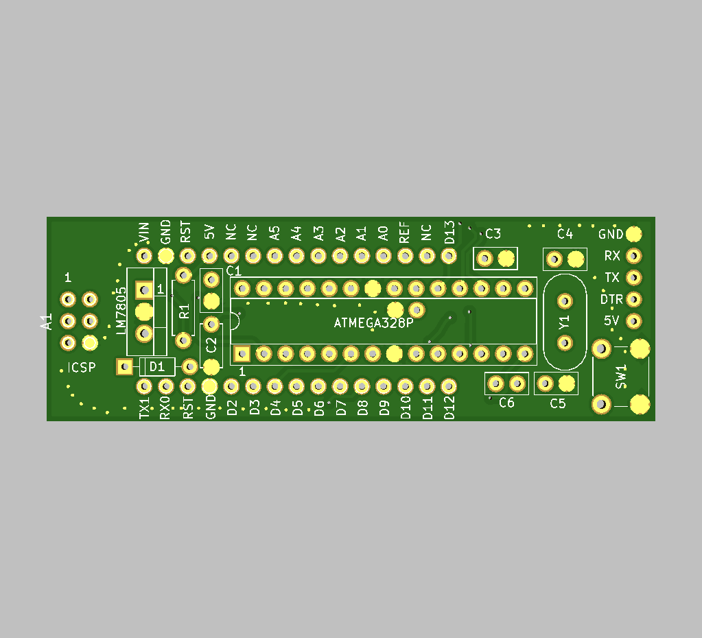

# Nano-like PCB using ATMEGA328P

Because of the 2021 chip shortage, any chip, especially SMT, is not available.  However, some ATMEGA328Ps can still be had or removed from older devices such as Arduino Uno.

I made a simple PCB that has the Arduino Nano pinout that takes a ATMEGA328P.  It connects to a serial port TTL device, using the DTR line for reset, and can be programmed using the Arduino IDE.  A cheap serial TTL converter is a CP2102 or CP2104 device.

ADC6 and ADC7 are not available because they are not exposed on the ATMEGA328P.

